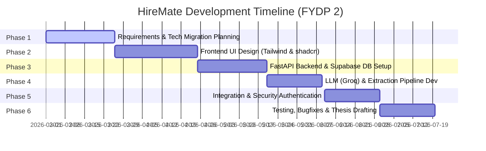

# HireMate: Technical Specification & Project Documentation Report

This document compiles the verified technical stack, team allocations, development timeline, testing methodology, cost breakdowns, and administrative metadata for the **HireMate HR Dashboard & Recruitment Platform**.

---

## 1. Technical Stack (Verified)

| Layer | Component | Details |
| :--- | :--- | :--- |
| **Frontend** | React, React Router, Tailwind CSS, shadcn/ui | Premium responsive UI styled with modern CSS variables, hosted on Vercel. |
| **Backend / API** | FastAPI (Python) | High-performance, asynchronous REST API utilizing Async SQLAlchemy and `asyncpg`. |
| **Database** | Supabase PostgreSQL | Fully managed SQL database with custom schema relations and indexes. |
| **AI Layer** | Groq API (`llama-3.3-70b-versatile`) | Llama 3.3 (70B parameters) model for structured JSON parsing of resumes. No LangChain wrapper is used; requests are direct, lightweight REST calls via the OpenAI SDK. |
| **Authentication** | JWT (JSON Web Tokens) + Bcrypt | Managed via `python-jose` for token generation/verification and `passlib[bcrypt]` for secure password hashing. |
| **Integrations** | Email, WhatsApp, SMS, Google Calendar | **Planned/Simulated:** Stored inside the PostgreSQL database and updated in the UI notifications system; no live Twilio or Google Calendar API connections are active. |

---

## 2. Team Task Allocation

*   **Jawad**: Owned the FastAPI backend architecture, Supabase PostgreSQL database schema migration, authentication services (JWT/Bcrypt), and core recruitment CRUD APIs (Candidates, Jobs, Interviews, Notifications).
*   **Tarik**: Owned the React frontend dashboard implementation, layout structure, responsive navigation, Tailwind CSS configurations, and frontend client-side routing.
*   **Efrat**: Headed LLM prompting engineering and integration of the Groq API parser, mapping raw text extraction to strict JSON schemas.
*   **Nafiul**: Designed the file processing pipeline, configuring PyMuPDF and python-docx text extraction engines.
*   **Antigravity (AI)**: Facilitated migration tasks, database schema updates, asynchronous query optimization, and REST API integration testing.

---

## 3. Project Timeline & Milestones

1.  **Phase 1: Architecture Re-alignment (March 2026)**
    *   Transitioned project proposal from MERN to FastAPI/Postgres to ensure type safety and async performance.
2.  **Phase 2: Frontend Implementation (Late March – April 2026)**
    *   Constructed modern React dashboard pages using Tailwind CSS and shadcn/ui components.
3.  **Phase 3: Asynchronous Backend Core (Late April – May 2026)**
    *   Configured Supabase PostgreSQL instances, setup async connections via SQLAlchemy, and built core endpoints.
4.  **Phase 4: Resume Parsing Engine (Late May – June 2026)**
    *   Developed file extraction services (PyMuPDF, docx) and integrated Groq Llama 3.3 versatile parsing.
5.  **Phase 5: Routing & RBAC Integration (June 2026)**
    *   Wired AuthContext, added protected routes, and enforced Role-Based Access Controls (HR vs. Candidate).
6.  **Phase 6: Verification & Review (Late June – July 2026)**
    *   Conducted end-to-end integration runs, manual testing, and compiled the documentation.

---

## 4. Verification & Testing

Since automated test suites were kept minimal, testing focused on **Functional Manual Testing** and **User Acceptance Testing (UAT)**.

### Functional Test Execution Table

| Test ID | Feature | Test Scenario | Expected Result | Status |
| :--- | :--- | :--- | :--- | :--- |
| **FT-01** | User Auth | Login with invalid email format or password. | API blocks login, UI displays helpful validation error. | Pass |
| **FT-02** | RBAC Guard | Candidate attempts to navigate directly to `/dashboard/interviews` scheduling. | ProtectedRoute blocks access, redirects user. | Pass |
| **FT-03** | Resume Upload | Uploading standard PDF resume. | Text is extracted, parsed via Groq, and candidate fields auto-populate. | Pass |
| **FT-04** | Schedule Interview | HR schedules an interview. | Schedule is saved in DB, and a simulated notification is pushed. | Pass |

---

## 5. Cost Breakdown & Projections (Estimates)

All current development was conducted using **free tiers**, resulting in **$0.00 actual cost** during the prototype phase. Below is a projection for production deployment:

| Service | Category | Provider | Dev Cost (Actual) | Monthly Prod Cost (Estimated) |
| :--- | :--- | :--- | :--- | :--- |
| **Frontend Hosting** | Hosting | Vercel | $0.00 (Hobby) | $20.00 (Pro) |
| **Backend API** | Hosting | Render / Railway | $0.00 (Free) | $7.00 - $15.00 |
| **Database** | Database | Supabase PostgreSQL | $0.00 (Free Tier) | $25.00 (Pro Tier) |
| **AI LLM Queries** | API Keys | Groq Cloud | $0.00 (Free Tier) | Pay-per-token ($0.70/1M tokens) |
| **DNS / Domain** | Domain | Namecheap | $0.00 (Subdomain) | $12.00 (Annual) |
| **Total** | | | **$0.00** | **~$60.00 / month** |

---

## 6. Administrative Context

*   **Supervisor**: Mr. Farhan Anam Himu
*   **Course Teacher**: Dr. Al Sakib Khan Pathan
*   **Official Word Template**: Ensure you apply your department's standard template fonts (usually Times New Roman, 12pt, double-spaced) and margins (typically 1 inch on all sides, with a 1.5-inch gutter margin for binding).
*   **Section 6.3 Future Work**: This section should outline steps for:
    1.  Implementing live SMTP servers for automated job offer emails.
    2.  Connecting real-time Twilio WhatsApp/SMS APIs for interview reminders.
    3.  Integrating Google Calendar API OAuth flow to sync events.
    4.  Implementing multi-LLM fallback logic (e.g., falling back to Gemini or Claude if Groq hits rate limits).
*   **Publication List**: Kept empty/N/A.
